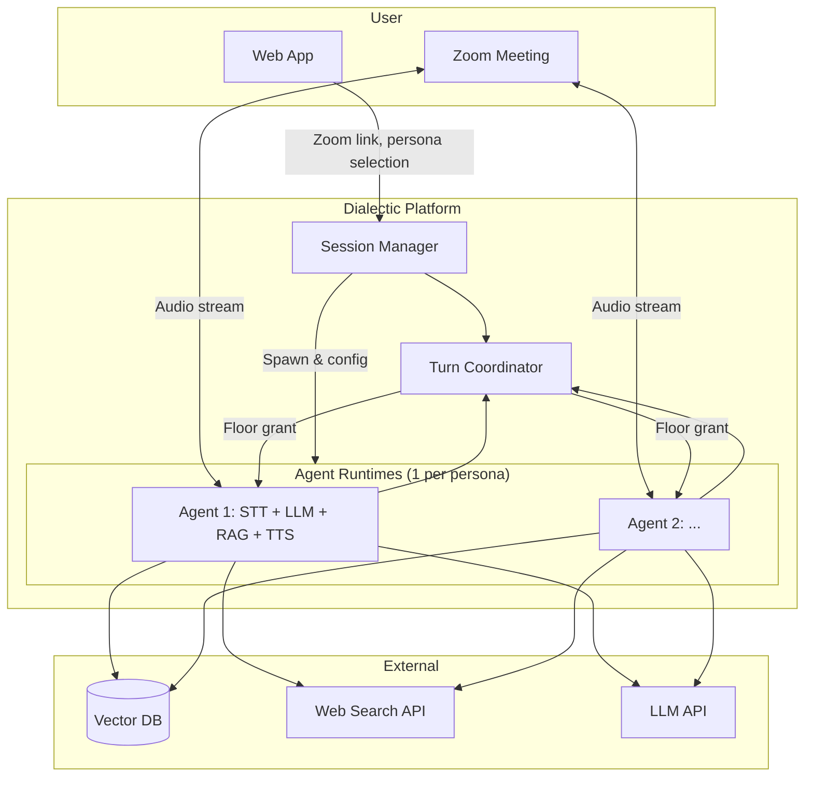

# Dialectic — Architecture (MVP)

## High-level system diagram

---

## Data flow (single turn)

1. **User speaks in Zoom** → meeting audio mix (and/or transcript) available to each joined agent.
2. **STT** (per agent or shared pipeline) → text segment.
3. **Turn Coordinator** decides which agent has the floor (directed address, urgency, or round-robin).
4. **RAG:** query vector DB with segment + persona docs → top-k chunks.
5. **LLM:** system prompt (persona) + RAG chunks + rolling transcript + optional web search result → reply text.
6. **TTS** → audio stream.
7. **Meeting client** streams agent audio into Zoom.
8. **Interruption:** if user (or another agent) speech detected while TTS playing → halt TTS, yield floor.

---

## Component roles

| Component | Responsibility | MVP note |
|-----------|----------------|----------|
| **Web App** | Persona config, Zoom link input, Start/End Session, optional rating | Next.js |
| **Session Manager** | Create session, spawn agent runtimes, pass Zoom credentials/config | One session = one meeting + N agents |
| **Agent Runtime** | STT → RAG + LLM → TTS; join meeting as one participant | One process/container per persona |
| **Turn Coordinator** | Floor arbitration; single speaker; silence/queue logic | Non-LLM; Redis or in-memory |
| **Meeting Connection** | Join Zoom (or LiveKit room), send/receive audio | Per agent |

---

## Security & config

- Zoom link and credentials must not be logged or stored in plain text beyond what’s needed for the session.
- API keys (LLM, STT, TTS, vector DB, web search) in env vars or secret manager; no keys in frontend.
- Document upload: validate type (PDF/TXT) and size (10MB cap per persona) server-side.

---

*For 48h build order and tech choices, see [ROADMAP.md](ROADMAP.md).*
